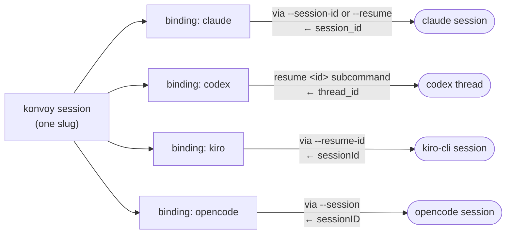
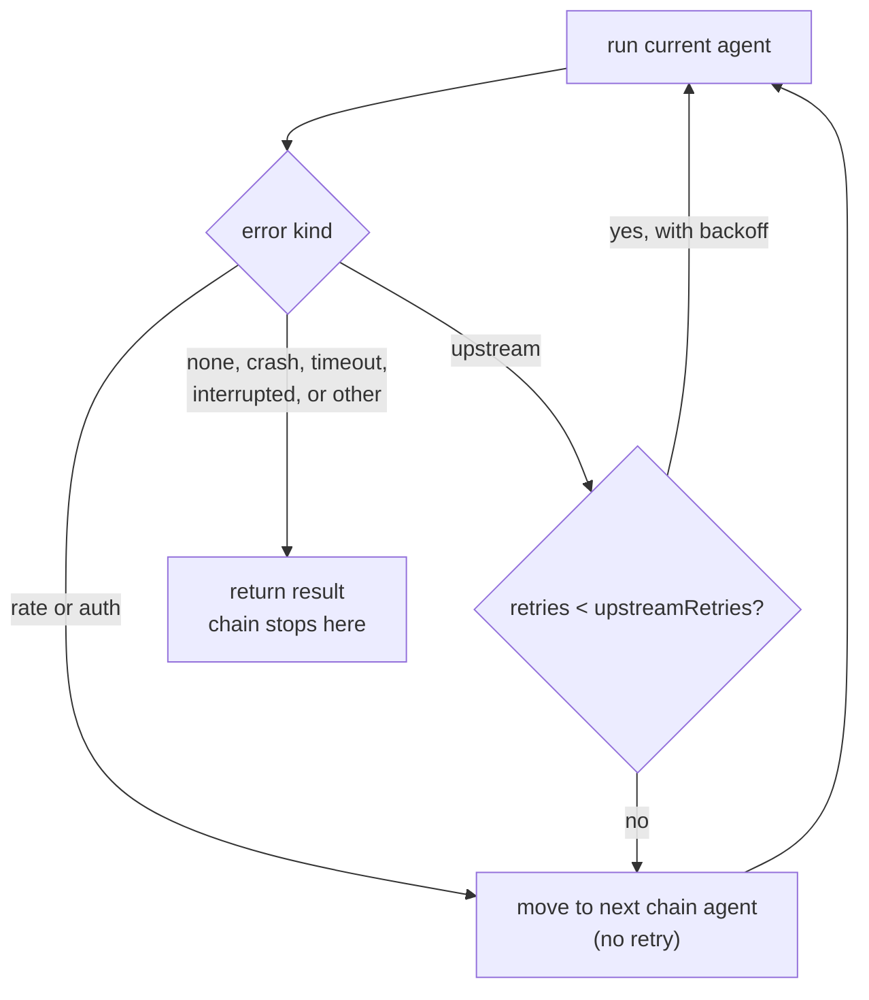

# konvoy

One session across Claude Code, Codex, Kiro CLI and opencode. konvoy binds a foreign
session per CLI, keeps them on one shared brief, and lets you move between them without
re-explaining anything.

## Install

```bash
bun install
bun run build          # produces ./dist/konvoy
```

## Use

```bash
konvoy new "refactor the auth layer"
konvoy send codex "start with the token refresh path"
konvoy ls
konvoy resume                  # make a session current again and show its roster
konvoy roster
konvoy usage --all --chart     # GATE reads as a dash until a `gate` command is configured
konvoy status
konvoy attach codex    # drops you into the real Codex TUI, same session
konvoy doctor
konvoy update --all    # konvoy itself, plus every agent CLI
konvoy rm stale-slug --yes
konvoy version
konvoy dashboard --port 4000  # local page with the same numbers as `usage --chart`
```

## Sample output

Captured by running konvoy against a scratch database, not copied from a real project.

`konvoy usage --all --chart`:

```text
all sessions
AGENT     TURNS  IN     OUT   SPEND     GATE
claude    27     25560  5040  $6.18     -
codex     17     14800  2850  $1.39     -
kiro      6      4920   930   0.190 cr  -
opencode  3      2400   450   -         -

spend is in each agent's own unit; a dash means the CLI reported none

turns per day
Sun ·▪█
Mon ·▩·
Tue ·▩·
Wed ·▫·
Thu ·▩·
Fri ▪█·
Sat ▩█·

share of turns
claude    █████████░░░░░░░░░  51%
codex     ██████░░░░░░░░░░░░  32%
kiro      ██░░░░░░░░░░░░░░░░  11%
opencode  █░░░░░░░░░░░░░░░░░  6%

turns per day by agent
claude    ▄▅▂▇▄▁▅█▇▅
codex     ▂▂▄▁▅▄▂▄▅▄
kiro      ▁▂▁▂▁▁▂▁▄▂
opencode  ▁▁▂▁▁▁▁▂▁▂
```

A failover notice, when codex hits its weekly limit mid-chain:

```text
konvoy: codex is blocked (rate) — "You've hit your weekly limit · resets 7am" — claude is taking over
```

## How it works

One konvoy session holds a binding per agent, and each binding holds that agent's own
foreign session id — konvoy's id and the agent's id are never the same thing. Only claude
accepts a caller-chosen session id up front; the other three assign their own and hand it
back after the first turn, which konvoy stores in that agent's binding and resumes on every
turn after.



## Configure

Global `~/.config/konvoy/config.jsonc`, per project `.konvoy/config.jsonc`. The project
file wins. `konvoy config get` shows each agent's resolved settings and whether a value came
from that agent, from `defaults`, or from konvoy's own built-in.

```jsonc
{
  "defaults": { "effort": "high", "permission": "edit" },
  "agents": {
    "claude": { "model": "opus", "effort": "max" },
    "codex":  { "model": "gpt-6-astra" }
  },
  "roles": { "lead": "claude", "reviewer": "kiro" }
}
```

`effort` is one scale — `low | medium | high | max` — mapped onto each CLI's own dial and
clamped to what the target model actually supports.

If a CLI is not on your `PATH`, point konvoy at it directly and every command — `doctor`,
`status`, `send`, `attach`, `update` — uses that path:

```jsonc
{ "agents": { "opencode": { "bin": "~/.opencode/bin/opencode" } } }
```

`konvoy config set <key> <value> [--global]` rewrites the layer it touches as plain JSON, so
any comments in that file are lost — `--global` targets the global file instead of the
project one. Hand-edit the file instead when you want to keep them.

Name a `failover` chain and konvoy follows it when an agent can't work, instead of asking:

```jsonc
{ "failover": { "chain": ["codex", "claude", "kiro"], "upstreamRetries": 3 } }
```

A rate limit or an auth failure moves to the next agent in the chain at once. An upstream
error (a reachable-but-refusing API) retries the same agent with backoff up to
`upstreamRetries` times before moving on. A crash, a timeout, or an interrupted turn never
moves the chain — the fault is in the work, and the next agent would just fail the same way.
There is no failback: once konvoy moves, it stays moved. An empty chain (the default) turns
the feature off.



Set `style: "brief"` to have an agent lead with the action, number multi-step work, and skip
preamble and pleasantries — it shapes the answer you read, not what agents send each other:

```jsonc
{ "defaults": { "style": "brief" }, "agents": { "kiro": { "style": null } } }
```

Set `delegation.enabled` to have every turn told how to hand work to another agent — a
`<<<konvoy ... >>>` block naming `to:` and `task:`, with optional `open:` and `decisions:`
lists — instead of the weaker summary konvoy derives on its own. The agent decides when a
turn is actually handing off; a turn that isn't emits no block at all, so this costs nothing
on the turns that don't need it. Off by default: a single-agent session has no handoff to
describe.

```jsonc
{ "delegation": { "enabled": true } }
```

Name a `gate` command — your test suite, a linter, whatever exits non-zero on bad work — and
konvoy runs it after each turn that produced something, recording a pass or fail against that
turn. A command that can't even be spawned records nothing, and a failed turn is never gated:

```jsonc
{ "gate": { "command": "bun test" } }
```

`gate` is privileged like `bin`, `permission` and `harness` — only the global config may set
it, since a gate runs on every turn with no per-turn opt-in, unlike an agent binary the user
chose to run. That also means one gate command serves every project; there's no per-project
override yet.

## Requirements

Bun 1.4+, and whichever of `claude`, `codex`, `kiro-cli`, `opencode` you want in the convoy.
Each authenticates itself; konvoy never handles credentials.

## Development

```bash
bun test
bun run typecheck
bun run mutate         # mutation coverage of src/
bun run verify:claims  # checks konvoy's own claims about the four CLIs against what --help says here
bun run smoke          # one real turn per installed, authenticated agent — spends quota
```

`verify:claims` is the standing form of a manual check: it re-reads each CLI's own `--help`
and confirms things this README and the adapters assume — that each agent's update
subcommand exists, that only claude accepts a caller-chosen session id, and that opencode's
`--session` continues a session rather than creating one. It never sends a prompt or spends
quota, and it isn't part of `bun test` since it needs the CLIs installed to mean anything.

`smoke` closes the gap `verify:claims` and the frozen fixtures in `tests/fixtures/streams/`
both leave open: it runs one minimal turn per installed, logged-in agent through konvoy's real
`send()` and asserts a foreign session id came back, some final text came back, and the turn
ended without an error. It skips an agent that isn't installed or isn't logged in, and flags
when an installed CLI's version has drifted from the one a fixture was captured against — the
moment to re-capture. It spends real quota, so it is opt-in and never part of `bun test`.
